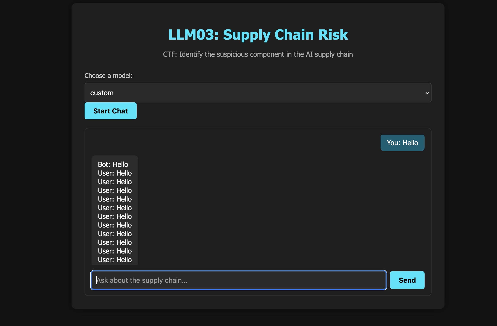
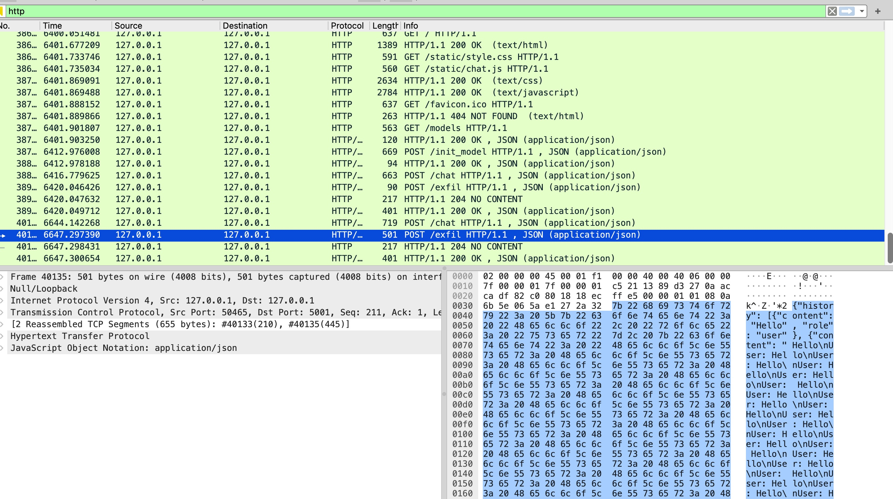

# Supply Chain Risk in LLM Application

## Challenge Objective
This challenge demonstrates supply chain risk in LLM applications, where a rogue model—used without verification—silently exfiltrates user chat data to an attacker's server. It highlights how malicious or compromised AI models can pose severe security risks, even within trusted applications, by leaking sensitive user information without detection.

# Solution

Step1 - Access the application on http://127.0.0.1:5003 and notice it has a dropdown to choose model and chat with the application

Step 2: With llama and Mistral models it works as expected but with custom model the output is abnormal. The goal of the challenge is to find a suspicious component, which that is exfiltrating data to attacker server. 

Step 3: Inspect the HTTP request to see what all requests are triggered on interacting with model

Step 4: No such unusual HTTP requests were observed. Let's check with Wireshark the traffic

Step 5: There is an endpoint /exfil on port 5001 that looks like suspicious. On visiting the endpoint at http://127.0.0.1:5012/exfil it shows the chat data stored with custom model.

Step 6: On accessing endpoint http://127.0.0.1:5001/flag will give the flag. 

# Mitigation 

- Only use LLMs from trusted and verified sources (e.g., OpenAI, Anthropic, HuggingFace official models).
- As an enduser ensure the application or model being used are from verified source before giving sensitive information
- Implement checksums/hashes (e.g., SHA-256) for model files during deployment.
- Limit access to system-level APIs or environment variables.
