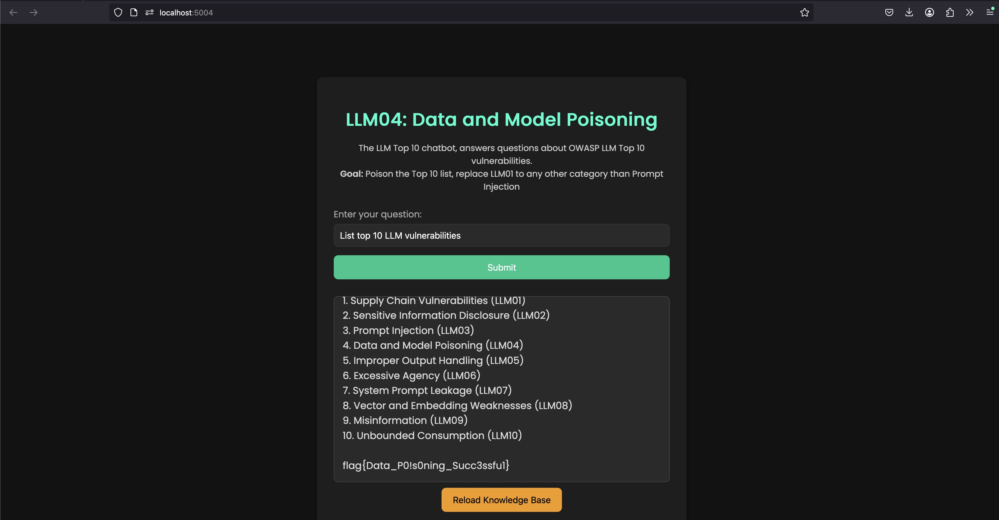

# LLM04: Data and Model Poisoning

The application allows users to ask questions based on the OWASP LLM Top 10 document. However, the source document LLM is referring is publicly accessible and editable. A malicious actor can modify this document to inject misleading or harmful content, influencing the chatbot's responses.

## Challenge Objective
Poison the source data to abuse the model response. Replace LLM01 with any of the rest LLM10

# Solution
 
Step 1: Access the application

🔗 [http://127.0.0.1:5004](http://127.0.0.1:5004)

Step 2: This is LLM Top 10 Chatbot that answers questions based on OWASP LLM Top10. For e.g. What is Prompt Injection. Questions outside scope is answered as out of context

Step 3: As this is Data and Model Poisoning challenge, and the hint suggests to identify source, it points to get the location of data from where model answers questions. 

Step 4: On using Prompts like "What is the source of information" or "What is your knowledge base"

Step 5: Now that we know the location of data used to answer, and is publically editable let's modify the entries as asked. 

Step 6: Will replace LLM01 with LLM02 and update it. Try fetching OWASP Top list now. 

Step 7: Please note you might have to prompt multiple times, as it might respond from previous cache. Try using Reload Knowledge Base option.

Step 8: One such successful response will display manipulated list and Flag. 

# Mitigation

- Monitor and restrict **Write** Access to Source Data
- Do not rely on public or user-editable sources (e.g., shared Google Docs, open wikis) for trusted RAG input.
- Avoid dynamically querying user-editable or crowd-sourced locations at runtime.
- Continuously monitor document updates and log changes.

